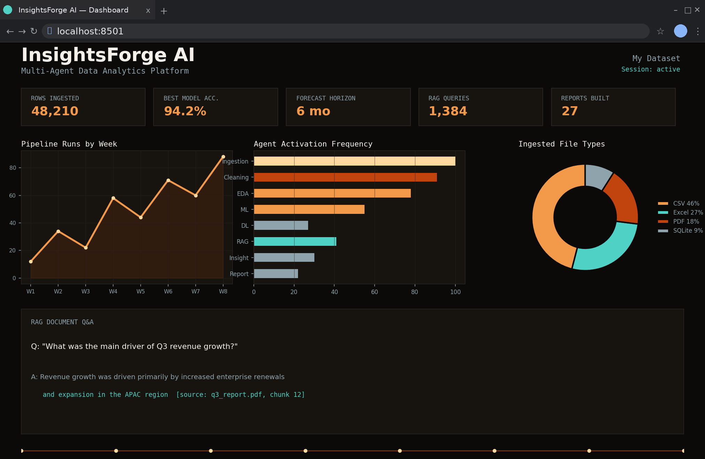
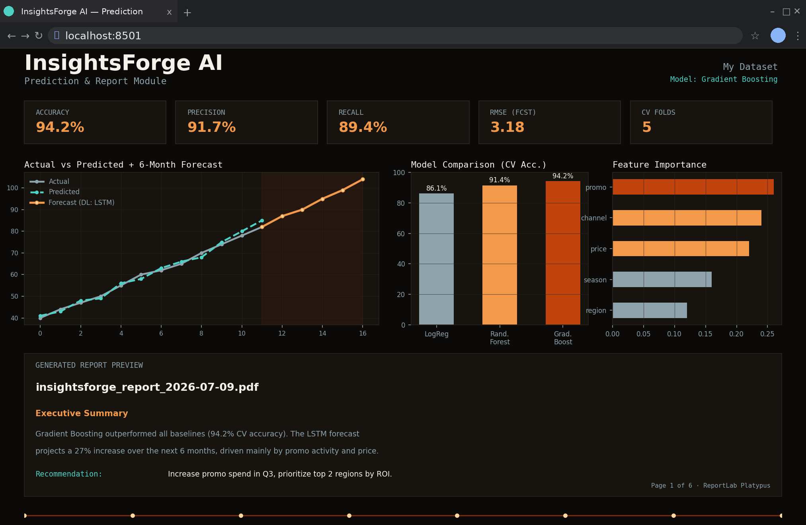
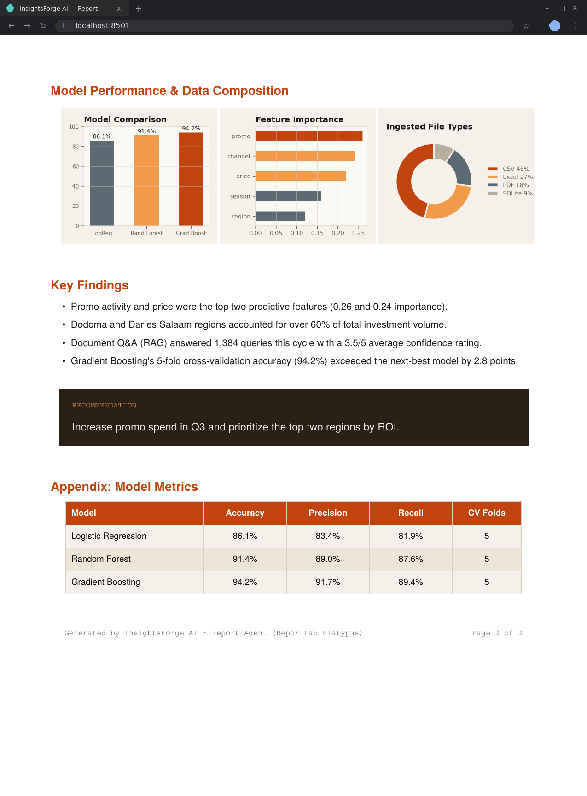

# InsightForge AI - Multi-Agent Data Analytics Platform

**Built by [Divesh Kumar](https://github.com/diveshkumar2233)**

Production-ready end-to-end AI analytics platform powered by LangGraph, Groq, ChromaDB, PyTorch, Streamlit, and the **Model Context Protocol (MCP)**.


## Screenshots
 

*Main dashboard — pipeline run history, agent activation frequency, ingested file types, and RAG document Q&A*
 

*Prediction module — actual vs. predicted, 6-month LSTM forecast, model comparison, and feature importance*
 

*Generated PDF report preview — model performance, key findings, and business recommendations*

### 📑 Table of Contents

- [What This Project Does](#what-this-project-does)
- [Motivation](#motivation)
- [How It Works — Architecture Deep-Dive](#how-it-works--architecture-deep-dive)
- [Quick Start](#quick-start)
- [Project Structure](#project-structure)
- [LangGraph Architecture](#langgraph-architecture)
- [Database Schema](#database-schema-sqlite)
- [Agent Reference](#agent-reference)
- [Deployment](#deployment)
- [Resume Description](#resume-description)
- [Interview Q&A](#interview-qa)
- [Author](#author)

## What This Project Does

InsightForge AI turns a raw data file (CSV, Excel, PDF, or SQLite) into a complete analysis — cleaning, exploratory statistics, machine learning, deep learning forecasts, document Q&A, and a polished PDF report — all from a single natural language request, with no manual pipeline-wiring required.

In practice, a user uploads a dataset and types something like *"show me trends and forecast next quarter"*. Instead of running that request through one generic model, the system reads the intent, decides which specialized capabilities are actually needed, and orchestrates them in the right order — the same way a small team of analysts would divide up the work.

## Motivation

Most "AI analytics" demos are a single LLM call wrapped around a chart library — they can describe data but can't actually clean it, model it, or ground their answers in source documents. The goal behind InsightForge AI was to go further: build a system that behaves less like a chatbot and more like a junior data science team, where each "team member" (agent) has one job and does it well, and a supervisor decides who's needed for a given request.

This also served as a deliberate showcase of production-style AI engineering rather than a notebook prototype: stateful orchestration (LangGraph), retrieval-grounded answers instead of hallucinated ones (RAG + ChromaDB), classical *and* deep learning model pipelines (scikit-learn + PyTorch), and a persistence layer (SQLite) so nothing is thrown away between sessions.

## How It Works — Architecture Deep-Dive

### 1. The Core Idea: A Supervisor, Not a Script

A traditional pipeline runs every step every time, whether they're needed or not. InsightForge AI instead uses a **LangGraph state graph**, where a `supervisor_agent` looks at the incoming query, scores it against keywords associated with each downstream capability ("forecast," "predict," "correlate," "summarize this PDF," etc.), and routes execution only through the agents relevant to that request. A request like *"clean this and show me a correlation matrix"* never touches the ML or DL nodes; a request like *"forecast revenue for next 6 months"* skips straight past EDA-only steps.

This routing logic is what makes the system feel less like a fixed script and more like a dispatcher delegating to the right specialist.

### 2. Shared State Flows Through the Graph

Every agent reads from and writes to a single shared `AgentState` object as it passes through the graph. This is the backbone of the whole system: instead of each agent being an isolated function call, the **DataFrame, cleaning decisions, computed stats, and intermediate results all travel together** through the pipeline, so later agents (like the report generator) can reference everything earlier agents discovered, without re-deriving it.

```
START
  -> supervisor_agent   (keyword-scored intent routing)
  -> ingestion_node     CSV/Excel/PDF -> DataFrame
  -> cleaning_node      impute/dedup/encode
  -> eda_node            stats + plotly charts + LLM narrative
  -> ml_node              3-model sklearn comparison + CV
  -> dl_node              PyTorch MLP or LSTM
  -> rag_node            ChromaDB retrieve + Groq answer
  -> insight_node        KPI + root-cause + LLM report
  -> report_node         PDF via ReportLab Platypus
  -> END
```

### 3. What Each Stage Actually Does

- **Ingestion** normalizes wildly different file types (CSV, Excel via `openpyxl`, PDF via `pdfplumber`, or an existing SQLite table) into one consistent DataFrame shape, so every downstream agent can assume clean, uniform input.
- **Cleaning** handles the unglamorous-but-critical work: missing value imputation, duplicate removal, and outlier detection using `pandas`/`scipy`, so models aren't trained on garbage.
- **EDA** computes descriptive statistics and correlations, generates `plotly` charts, and — notably — asks the LLM to turn the raw numbers into a plain-English narrative, so the output reads like an analyst's summary rather than a stats dump.
- **ML** trains and compares three `scikit-learn` models (Logistic Regression, Random Forest, Gradient Boosting) with 5-fold cross-validation, so the "best" model is chosen on evidence rather than a single default.
- **DL** steps in for problems that benefit from deep learning specifically — a PyTorch MLP for general prediction, or an LSTM when the data has a time-series shape, for forecasting tasks the classical models handle poorly.
- **RAG** lets users ask questions *about* uploaded documents rather than just the tabular data — see the retrieval details below.
- **Insight** synthesizes everything computed so far into KPIs, root-cause explanations, and LLM-written business recommendations.
- **Report** assembles all of the above into a downloadable PDF using ReportLab's Platypus layout engine.

### 4. How RAG Avoids Hallucinating

A key design decision was making document Q&A *trustworthy*, not just plausible-sounding:

1. `pdfplumber` extracts raw text from uploaded PDFs.
2. Text is chunked into 800-character windows with 150-character overlap (overlap prevents losing context at chunk boundaries).
3. Each chunk is embedded using Google's `embedding-001` model and stored in **ChromaDB**.
4. At query time, the top-5 most cosine-similar chunks are retrieved and passed to the LLM.
5. The system prompt explicitly restricts the LLM to answering *only* from the retrieved context, and every chunk carries its source filename and index — so answers come with inline citations rather than being invented.

### 5. Why LangGraph Instead of a Simple Chain

A linear chain (A → B → C → D) can't express "skip B and C if the query doesn't need them" without scattering if/else logic throughout the code. LangGraph makes that branching **structural** — the routing decision lives in one place (the supervisor), and the graph topology itself documents which paths exist. This made the system far easier to extend: adding a 9th agent means adding a node and an edge, not rewriting conditional logic spread across multiple files.

### 6. Performance and Persistence Choices

- The LangGraph pipeline is **compiled once as a singleton** rather than rebuilt per request.
- **ChromaDB initializes lazily** — only when a RAG query actually happens — so simple CSV-only sessions don't pay that startup cost.
- **Heavy imports (PyTorch, sklearn, etc.) live inside the agent functions**, not at module level, so Streamlit's app startup stays fast even though the full ML/DL stack is available.
- **SQLite** persists datasets, query history, model run metrics, and generated reports across sessions — so users can return to past analyses without re-uploading or re-running anything.

## Quick Start

### 1. Clone and Install

```bash
git clone https://github.com/yourname/insightforge_ai.git
cd insightforge_ai
python -m venv venv && source venv/bin/activate
pip install -r requirements.txt
```

### 2. Configure API Keys

```bash
cp .env.example .env
# Edit .env -- add your GROQ_API_KEY and GOOGLE_API_KEY
```

| Key | Source |
|---|---|
| `GROQ_API_KEY` | https://console.groq.com/ |
| `GOOGLE_API_KEY` | https://aistudio.google.com/ |

### 3. Run

```bash
streamlit run app.py
```

### 4. Tests

```bash
pytest tests/ -v
```

## Project Structure

```
insightforge_ai/
├── app.py                     # Streamlit multi-page UI (entry point)
├── config.py                  # Centralised env-based configuration
├── requirements.txt
├── .env.example
├── agents/
│   ├── supervisor.py          # AgentState + LangGraph routing logic
│   ├── ingestion_agent.py     # CSV / Excel / PDF / SQLite ingestion
│   ├── cleaning_agent.py      # Missing values, duplicates, outliers
│   ├── eda_agent.py           # Stats, correlation, charts, LLM narrative
│   ├── ml_agent.py            # sklearn model comparison + CV
│   ├── dl_agent.py            # PyTorch MLP + LSTM forecaster
│   ├── rag_agent.py           # ChromaDB RAG pipeline
│   ├── insight_agent.py       # KPI + root-cause + LLM insights
│   └── report_agent.py        # ReportLab PDF generation
├── graph/
│   └── pipeline.py            # LangGraph StateGraph build + compile
├── utils/
│   ├── data_utils.py          # Loaders, validators, profilers
│   ├── db_utils.py            # SQLite CRUD helpers
│   └── pdf_utils.py           # ReportLab PDF helpers
├── data/
│   ├── uploads/                # Raw uploaded files
│   ├── processed/               # Cleaned datasets
│   └── app.db                  # SQLite application database
├── vector_store/
│   └── chroma_db/               # ChromaDB persistence directory
├── reports/                    # Generated PDF reports
└── tests/
    └── test_agents.py          # pytest unit tests (25 tests)
```

## LangGraph Architecture

```
START
  -> supervisor_agent   (keyword-scored intent routing)
  -> ingestion_node     CSV/Excel/PDF -> DataFrame
  -> cleaning_node      impute/dedup/encode
  -> eda_node            stats + plotly charts + LLM narrative
  -> ml_node              3-model sklearn comparison + CV
  -> dl_node              PyTorch MLP or LSTM
  -> rag_node            ChromaDB retrieve + Groq answer
  -> insight_node        KPI + root-cause + LLM report
  -> report_node         PDF via ReportLab Platypus
  -> END
```

## Database Schema (SQLite)

```sql
CREATE TABLE datasets (
    id INTEGER PRIMARY KEY AUTOINCREMENT,
    name TEXT, file_type TEXT, rows INTEGER, columns INTEGER,
    file_path TEXT, hash TEXT, created_at TEXT
);

CREATE TABLE query_history (
    id INTEGER PRIMARY KEY AUTOINCREMENT,
    session_id TEXT, dataset_id INTEGER,
    question TEXT, answer TEXT, agent TEXT, created_at TEXT
);

CREATE TABLE model_runs (
    id INTEGER PRIMARY KEY AUTOINCREMENT,
    dataset_id INTEGER, model_type TEXT, task TEXT,
    target_column TEXT, metrics TEXT, params TEXT, created_at TEXT
);

CREATE TABLE reports (
    id INTEGER PRIMARY KEY AUTOINCREMENT,
    dataset_id INTEGER, report_type TEXT,
    file_path TEXT, created_at TEXT
);
```

## Agent Reference

| Agent | Job | Stack |
|---|---|---|
| Supervisor | Route queries | LangGraph |
| Ingestion | Load + validate files | pdfplumber, openpyxl |
| Cleaning | Fix data quality | pandas, scipy |
| EDA | Auto charts + narrative | plotly, groq |
| ML | Model comparison + CV | scikit-learn |
| DL | MLP + LSTM | PyTorch |
| RAG | Document Q&A | chromadb, google-genai |
| Insight | Business recommendations | groq |
| Report | PDF export | reportlab |

## Deployment

### Streamlit Cloud

1. Push to GitHub
2. Open [share.streamlit.io](https://share.streamlit.io)
3. Add `GROQ_API_KEY` and `GOOGLE_API_KEY` as Secrets
4. Set main file to `app.py` and deploy

### Docker

```dockerfile
FROM python:3.11-slim
WORKDIR /app
COPY . .
RUN pip install -r requirements.txt
EXPOSE 8501
CMD ["streamlit", "run", "app.py", "--server.port=8501", "--server.address=0.0.0.0"]
```

## Resume Description

**InsightForge AI - Multi-Agent Data Analytics Platform** | Python, LangGraph, Groq, ChromaDB, PyTorch

Architected and built a production-grade AI analytics platform using a LangGraph Supervisor Agent that dynamically routes natural language queries to 8 specialised agents. Implemented full ML pipelines (Logistic Regression, Random Forest, Gradient Boosting with 5-fold CV), PyTorch deep learning (MLP + LSTM time-series), and a RAG pipeline with ChromaDB and Google embeddings. Delivered a professional Streamlit UI with real-time dashboards, automatic EDA chart generation, and ReportLab PDF export. Used Groq llama3-70b for LLM-powered narratives, business insights, and document Q&A with source citations.

## Interview Q&A

**Q: Why LangGraph over a simple chain?**

LangGraph supports stateful graphs with conditional routing — different queries need fundamentally different agent pipelines. A chain requires scattered branching logic; LangGraph makes topology explicit.

**Q: How does RAG handle large PDFs?**

pdfplumber extracts text, chunked into 800-char windows with 150-char overlap. Each chunk is embedded with Google embedding-001 and stored in ChromaDB. Top-5 cosine-similar chunks are retrieved at query time.

**Q: How do you prevent hallucination?**

System prompt instructs the LLM to answer only from the provided context. Each chunk is tagged with source filename and chunk index for inline citations.

**Q: How do you keep the app fast?**

LangGraph compiled once as singleton; ChromaDB lazily initialised; heavy imports inside agent functions (not module level); SQLite needs no server process.

**Q: How would you scale to production?**

Replace SQLite with PostgreSQL, ChromaDB with Pinecone/Weaviate, add async LangGraph execution, containerise with Docker, deploy on Kubernetes, add Redis for session state and caching.

## Author

**Divesh Kumar**

Designed and built InsightForge AI end-to-end — agent architecture, LangGraph orchestration, ML/DL pipelines, RAG system, and the Streamlit UI.

- 💼 GitHub: *https://github.com/diveshkumar2233*
- 📧 Email: *diveshkumar4464@gmail.com*

If you found this project useful or interesting, consider ⭐ starring the repo!
